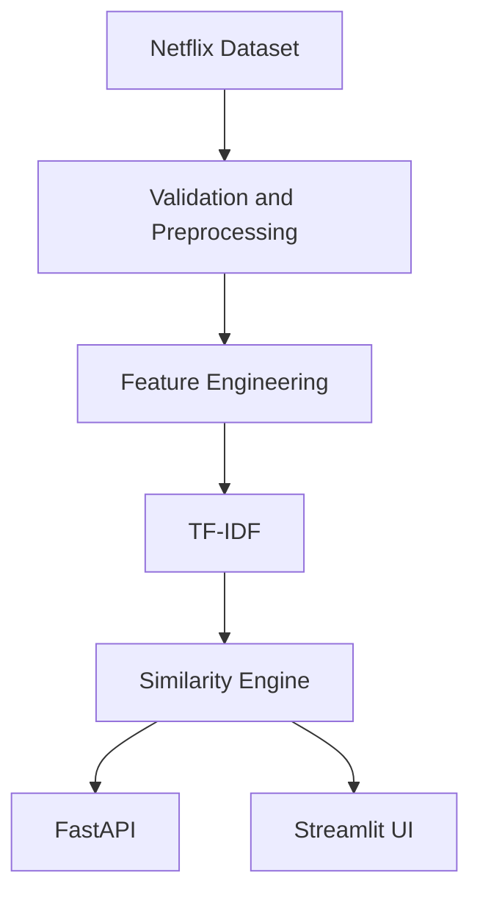

# CineMatch

CineMatch is a professional, content-based Netflix title recommendation system. It uses catalog metadata, TF-IDF, and cosine similarity to recommend titles similar to a title selected by the user.

This project is metadata-based, not personalized: the provided CSV has no user ratings or watch history, so it does not claim to learn individual preferences.

## Features

- Configurable CSV loading and validation
- Missing-value normalization and duplicate-title handling
- Configurable content feature construction
- Offline TF-IDF artifact building
- Cosine-similarity top-N recommendations
- FastAPI REST API with OpenAPI docs
- Streamlit interface
- Premium discovery UI with Home, Explore, title details, and How it works views
- Pytest unit and integration tests
- Logging, environment configuration, Docker, and Compose
- Honest metadata-only evaluation

## Architecture



Expensive work runs offline. API requests load a prepared artifact once, find the selected title, calculate or retrieve similarity scores, exclude the query title, and return ranked metadata.

## Installation

Python 3.10 or newer is supported. From PowerShell:

```powershell
python -m venv .venv
.venv\Scripts\Activate.ps1
python -m pip install -e ".[dev]"
$env:PYTHONPATH = "src"
```

## Dataset setup

Place a licensed CSV at `data/raw/netflix_titles.csv`, or set `DATASET_PATH`. The only required column is `title`; optional metadata fields are documented in `data/README.md`. No dataset or fake recommendations are included in this repository.

## Build and run

```powershell
python scripts/preprocess.py
python scripts/build_recommender.py
python scripts/evaluate.py
```

Start the API:

```powershell
$env:PYTHONPATH = "src"
uvicorn netflix_recommender.api.main:app --host 127.0.0.1 --port 8001 --reload
```

If port 8001 is already in use, override it:

```powershell
$env:PYTHONPATH = "src"
uvicorn netflix_recommender.api.main:app --host 127.0.0.1 --port 8010 --reload
```

Then visit `http://127.0.0.1:8001/docs` or request:

```text
GET http://127.0.0.1:8001/recommend?title=Stranger%20Things&top_n=5
```

Start Streamlit in another terminal with `PYTHONPATH` set:

```powershell
$env:PYTHONPATH = "src"
streamlit run app/streamlit_app.py --server.port 8501 --server.headless true
```

## API response shape

The exact recommendations depend on the supplied dataset and are generated at runtime:

```json
{
  "query_title": "Stranger Things",
  "recommendations": [
    {
      "title": "Example title from the catalog",
      "similarity_score": 0.82,
      "type": "TV Show",
      "listed_in": "Dramas",
      "release_year": 2017,
      "rating": "TV-14",
      "description": "Metadata from the source catalog."
    }
  ]
}
```

Unknown titles return 404. Invalid `top_n` values return 422. Missing artifacts return 503.

## User Interface

CineMatch provides a cinematic, responsive Streamlit experience for:

- Searching and selecting titles
- Viewing title metadata and detail states
- Receiving ranked content-similarity recommendations
- Exploring the full catalog by type and sort order
- Understanding the TF-IDF and cosine-similarity pipeline

Recommendation scores are labeled as content similarity. They are not predictions of personal enjoyment, and the interface does not claim personalization without user history.

## Tests and quality checks

```powershell
python -m pytest -q
ruff check src scripts tests
mypy src
```

## Docker

Build the artifact first so `data/artifacts/recommender.joblib` exists, then:

```powershell
docker compose build
docker compose up
```

The API is exposed at `http://localhost:8000`. The container runs as a non-root user and mounts `data/` read-only.

## Project structure

- `src/netflix_recommender/data`: loading, validation, and cleaning
- `src/netflix_recommender/features`: text and TF-IDF feature construction
- `src/netflix_recommender/recommender`: artifact lifecycle and ranking engine
- `src/netflix_recommender/api`: FastAPI application and schemas
- `app`: Streamlit UI
- `scripts`: repeatable build, preprocessing, and evaluation commands
- `tests`: unit and API integration tests
- `docs`: architecture, methodology, ML concepts, evaluation, deployment, and limitations
- `data`: user-supplied raw data and generated artifacts

## Methodology

`Preprocessing -> feature selection -> content text -> TF-IDF -> cosine similarity -> ranking -> API/UI`.

TF-IDF turns each title's combined text into a sparse weighted vector. Cosine similarity compares vector direction, which makes it useful when documents have different lengths. The system uses a baseline with equal combined-field treatment; field weighting can be introduced as a measured experiment later.

## Limitations and future work

The system has no collaborative filtering, user profiles, or feedback loop. Lexical TF-IDF can miss semantic similarity, and duplicate strings are retained only once. Future improvements include hybrid recommendation, embeddings, explicit relevance judgments, user feedback, and a vector database for very large catalogs. See `docs/limitations.md`.
