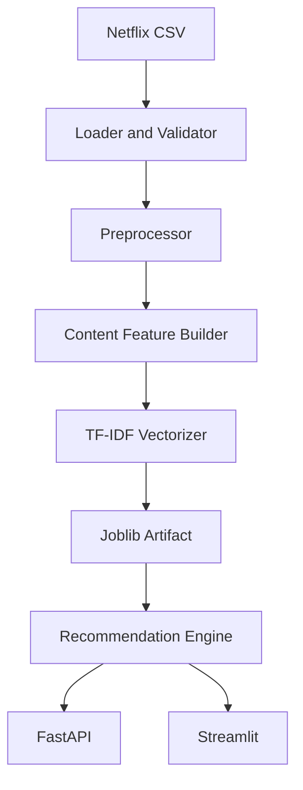

# Architecture

CineNexus separates offline model construction from online serving.

The artifact contains cleaned metadata and a sparse TF-IDF matrix. The API loads it once during app creation. A request performs title lookup, cosine similarity against the query row, self-exclusion, and stable top-N ranking.

The engine does not import FastAPI or Streamlit, so it can also be reused by a CLI, batch job, or future service.
